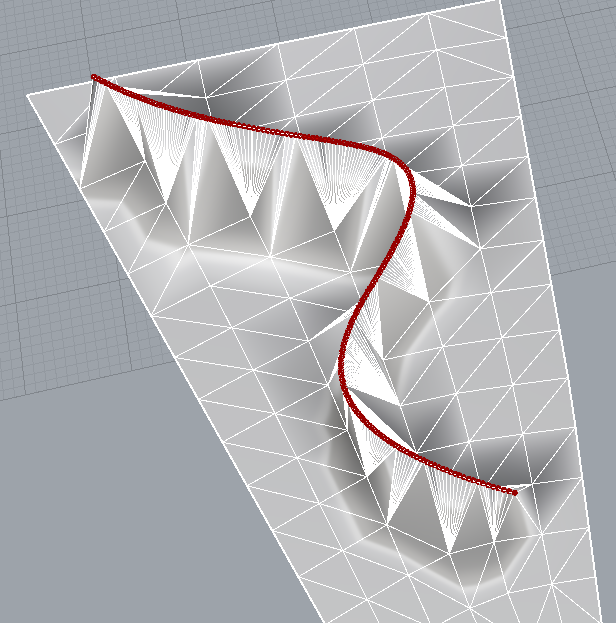
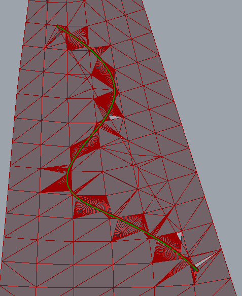
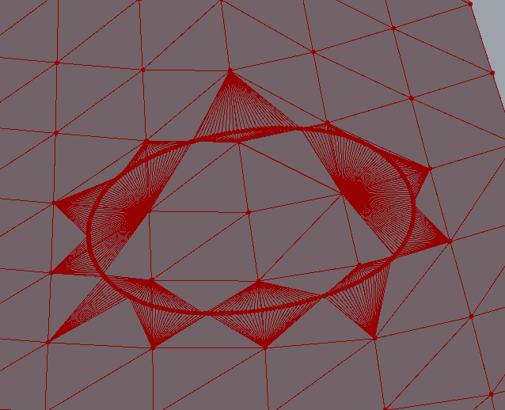

# Cut Meshes

`meshsdk` has set of functions to cut mesh, you can find it in this [header](https://github.com/alpinebuster/meshsdk/blob/master/source/MRMesh/MRContoursCut.h).





## Suggested steps

1.Project points of your polyline to mesh

```cpp
#include "MRMesh/MRMeshProject.h"

struct MeshProjectionResult
{
    /// the closest point on mesh, transformed by xf if it is given
    PointOnFace proj;
    /// its barycentric representation
    MeshTriPoint mtp;
    /// squared distance from pt to proj
    float distSq = 0;
};

/// 
/**
 * \brief computes the closest point on mesh (or its region) to given point
 * \param upDistLimitSq upper limit on the distance in question, if the real distance is larger than the function exits returning upDistLimitSq and no valid point
 * \param xf mesh-to-point transformation, if not specified then identity transformation is assumed
 * \param loDistLimitSq low limit on the distance in question, if a point is found within this distance then it is immediately returned without searching for a closer one
 * \param skipFace this triangle will be skipped and never returned as a projection
 */
[[nodiscard]] MRMESH_API MeshProjectionResult findProjection( const Vector3f & pt, const MeshPart & mp,
    float upDistLimitSq = FLT_MAX,
    const AffineXf3f * xf = nullptr,
    float loDistLimitSq = 0,
    FaceId skipFace = {} );
```

2.Convert result vector to cutMesh input type:

```cpp
#include "MRMesh/MRContoursCut.h"

/** \ingroup BooleanGroup
  * \brief Makes closed continuous contour by mesh tri points
  * 
  * Finds shortest paths between neighbor \p meshTriPoints and build closed contour MR::cutMesh input
  */
MRMESH_API OneMeshContour convertMeshTriPointsToClosedContour( const Mesh& mesh, const std::vector<MeshTriPoint>& meshTriPoints );
```

> Note that conversion is not 1 to 1, so output contour may contain other amount of items than input one

3.Do `cutMesh` (it works only with contours without self-intersections)

```cpp
#include "MRMesh/MRContoursCut.h"

/** \struct MR::CutMeshResult
  * \ingroup BooleanGroup
  * This structure contains result of MR::cutMesh function
  */
struct CutMeshResult
{
    /// Paths of new edges on mesh, they represent same contours as input, but already cut
    std::vector<EdgePath> resultCut;
    /// Bitset of bad triangles - triangles where input contours have intersections and cannot be cut and filled in a good way
    /// \sa \ref MR::CutMeshParameters
    FaceBitSet fbsWithCountourIntersections;
};

/** \ingroup BooleanGroup
  * \brief Cuts mesh by given contours
  * 
  * This function cuts mesh making new edges paths on place of input contours
  * \param mesh Input mesh that will be cut
  * \param contours Input contours to cut mesh with, find more \ref MR::OneMeshContours
  * \param params Parameters describing some cut options, find more \ref MR::CutMeshParameters
  * \return New edges that correspond to given contours, find more \ref MR::CutMeshResult
  * \parblock
  * \warning Input contours should have no intersections, faces where contours intersects (`bad faces`) will not be allowed for fill
  * \endparblock
  * \parblock
  * \warning Input mesh will be changed in any case, if `bad faces` are in mesh, mesh will be spoiled, \n
  * so if you cannot guarantee contours without intersections better make copy of mesh, before using this function
  * \endparblock
  */
MRMESH_API CutMeshResult cutMesh( Mesh& mesh, const OneMeshContours& contours, const CutMeshParameters& params = {} );
```

`resultCut` has 1 to 1 mapping to cutMesh input contours

4.Pull `resultCut` vertices to corresponding original polyline positions

```cpp
#include "MRMesh/MRPolylineProject.h"

template<typename V>
struct PolylineProjectionResult
{
    /// closest line id on polyline
    UndirectedEdgeId line;
    /// closest point on polyline, transformed by xf if it is given
    V point;
    /// squared distance from pt to proj
    float distSq = 0;
};

/**
 * \brief computes the closest point on polyline to given point
 * \param upDistLimitSq upper limit on the distance in question, if the real distance is larger than the function exists returning upDistLimitSq and no valid point
 * \param xf polyline-to-point transformation, if not specified then identity transformation is assumed
 * \param loDistLimitSq low limit on the distance in question, if a point is found within this distance then it is immediately returned without searching for a closer one
 */
MRMESH_API PolylineProjectionResult3 findProjectionOnPolyline( const Vector3f& pt, const Polyline3& polyline,
    float upDistLimitSq = FLT_MAX, AffineXf3f* xf = nullptr, float loDistLimitSq = 0 );
```

This should work for common cases, complex polylines with self-intersections may require some preprocessing.
