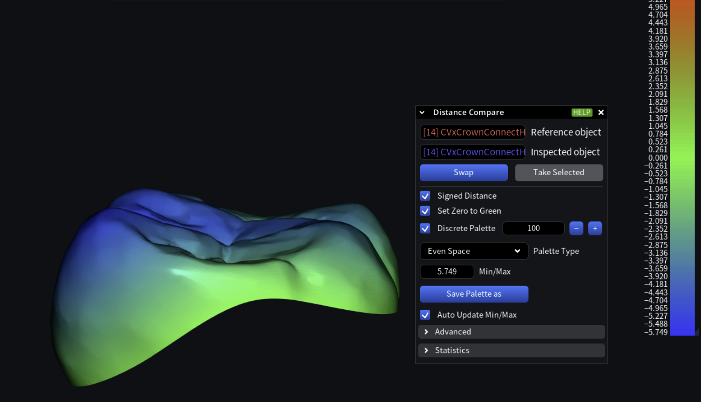

# Implement Distance Compare option in c++

Implement Distance Compare function.



Use this function:

`asmesh/source/MRMesh/MRPointsToMeshProjector.h`

Lines 53 to 60 in d64341c

```cpp
/// Computes signed distances from valid vertices of test mesh to the closest point on the reference mesh: 
/// positive value - outside reference mesh, negative - inside reference mesh; 
/// this method can return wrong sign if the closest point is located on self-intersecting part of the mesh 
[[nodiscard]] MRMESH_API VertScalars findSignedDistances( 
    const Mesh& refMesh, ///< the distances to this mesh will be returned 
    const Mesh& mesh,    ///< the distances from valid vertices of this mesh will be returned 
    const MeshProjectionParameters & params = {}, 
    IPointsToMeshProjector * projector = {} ); ///< if projector is not given then CPU's computations will be used
```

with CPU or GPU projector:

- [MRPointsToMeshProjector](https://github.com/alpinebuster/meshlib/blob/master/source/MRMesh/MRPointsToMeshProjector.h)
- [MRCudaPointsToMeshProjector](https://github.com/alpinebuster/meshlib/blob/master/source/MRCuda/MRCudaPointsToMeshProjector.h)
