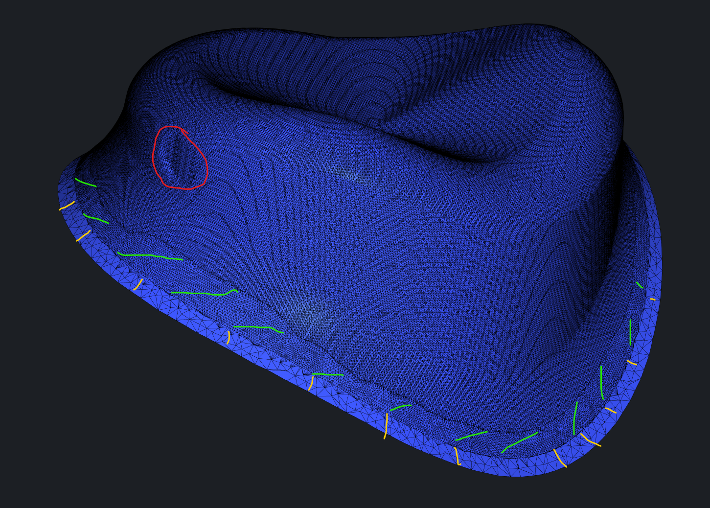
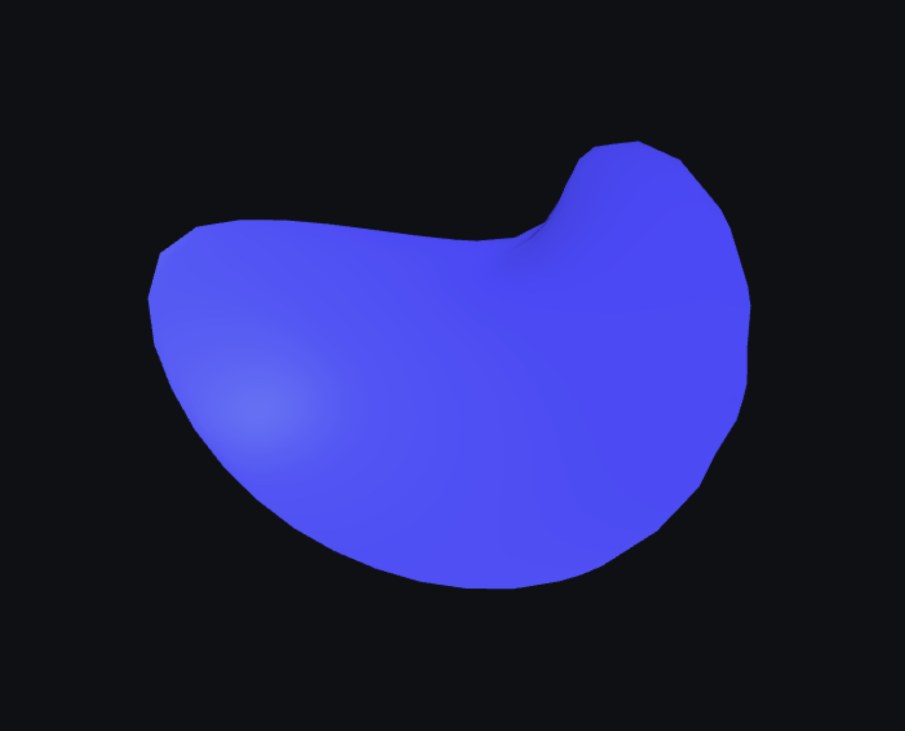
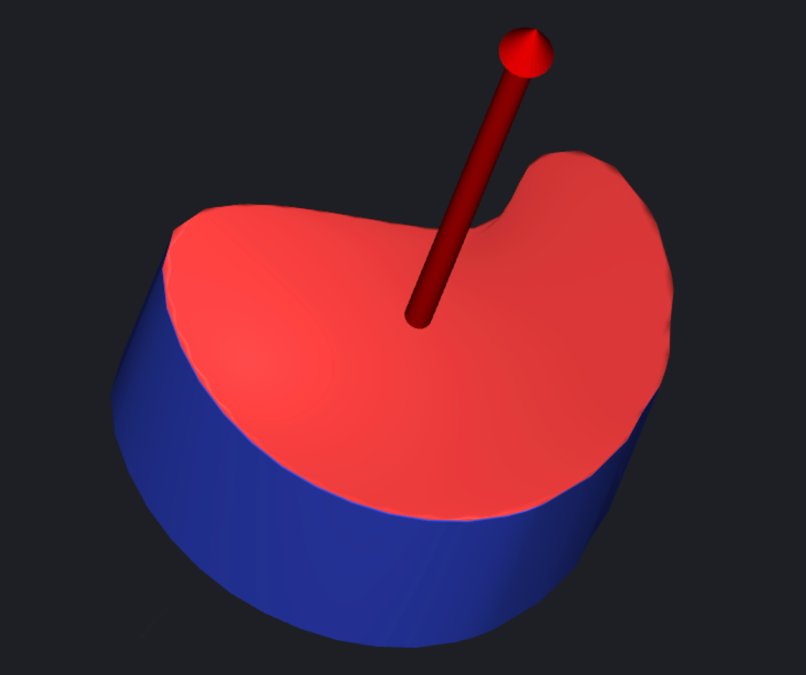

# Extrude Base (with undercuts fixing)

Right now the algorithm is based on voxels conversion, so result mesh is completely rebuild. (this particular algorithm requires closed mesh on input, so if mesh is open we close it ourselves before applying).

We will consider implementing another algorithm or an option in this one to support open mesh.

## Methods

Now there is no simple way to preserve boundary after calling fixUndercuts because it rebuilds mesh completely.

One thing you can try is something like this:

1.Save boundary as polyline
2.Call `fixUndercuts`
3.Project saved polyline to mesh and move it a little up

`asmesh/source/MRMesh/MRContoursCut.h`

Lines 97 to 106 in d717e06

```cpp
/** \ingroup BooleanGroup 
 * \brief Makes continuous contour by iso-line from mesh tri points, if first and last meshTriPoint is the same, makes closed contour 
 * 
 * Finds shortest paths between neighbor \p surfaceLine and build offset contour on surface for MR::cutMesh input 
 * \param offset amount of offset form given point, note that absolute value is used and isoline in both direction returned 
 * \param searchSettings settings for search geodesic path 
 */ 
[[nodiscard]] 
MRMESH_API Expected<OneMeshContours> convertMeshTriPointsSurfaceOffsetToMeshContours( const Mesh& mesh, const std::vector<MeshTriPoint>& surfaceLine, 
    float offset, SearchPathSettings searchSettings = {} );
```

4.Cut mesh above old boundary
`asmesh/source/MRMesh/MRContoursCut.h`

Lines 219 to 235 in d717e06

```cpp
/** \ingroup BooleanGroup 
 * \brief Cuts mesh by given contours 
 *  
 * This function cuts mesh making new edges paths on place of input contours 
 * \param mesh Input mesh that will be cut 
 * \param contours Input contours to cut mesh with, find more \ref MR::OneMeshContours 
 * \param params Parameters describing some cut options, find more \ref MR::CutMeshParameters 
 * \return New edges that correspond to given contours, find more \ref MR::CutMeshResult 
 * \parblock 
 * \warning Input contours should have no intersections, faces where contours intersects (`bad faces`) will not be allowed for fill 
 * \endparblock 
 * \parblock 
 * \warning Input mesh will be changed in any case, if `bad faces` are in mesh, mesh will be spoiled, \n 
 * so if you cannot guarantee contours without intersections better make copy of mesh, before using this function 
 * \endparblock 
 */ 
MRMESH_API CutMeshResult cutMesh( Mesh& mesh, const OneMeshContours& contours, const CutMeshParameters& params = {} ); 
```

5.Stitch cut place with old boundary
`asmesh/source/MRMesh/MRMeshFillHole.h`

Lines 85 to 106 in d717e06

```cpp
/** \brief Stitches two holes in Mesh\n 
 * 
 * Build cylindrical patch to fill space between two holes represented by one of their edges each,\n 
 * default metric: ComplexStitchMetric 
 * 
 * \image html fill/before_stitch.png "Before" width = 250cm 
 * \image html fill/stitch.png "After" width = 250cm 
 *  
 * Next picture show, how newly generated faces can be smoothed 
 * \ref MR::positionVertsSmoothly 
 * \ref MR::subdivideMesh 
 * \image html fill/stitch_smooth.png "Stitch with smooth" width = 250cm 
 *  
 * \param mesh mesh with hole 
 * \param a EdgeId which represents 1st hole (should not have valid left FaceId) 
 * \param b EdgeId which represents 2nd hole (should not have valid left FaceId) 
 * \param params parameters of holes stitching 
 * 
 * \sa \ref fillHole 
 * \sa \ref StitchHolesParams 
 */ 
MRMESH_API void buildCylinderBetweenTwoHoles( Mesh & mesh, EdgeId a, EdgeId b, const StitchHolesParams& params = {} ); 
```

Result might look somehow like this:

- Red - fixed area
- Yellow - strip of original mesh
- Green - stitched area



## Examples

```cpp
vector<OneMeshContour> contours;
contours.push_back(result.value().back());

auto resultCut = cutMesh(meshIn, contours).resultCut;
contours.clear();
contours.shrink_to_fit();

auto mesh0 = fillContourLeft(meshIn.topology, resultCut);
auto mesh1 =meshIn.topology.getValidFaces()- mesh0;

Mesh cutMesh0 = Mesh();
cutMesh0.addPartByMask(meshIn, mesh0);
Mesh cutMesh1 = Mesh();
cutMesh1.addPartByMask(meshIn, mesh1);

for (Vector3f v :aaaa) 
{
    cutMesh1.addPoint(v);
}

EdgePath edgePath = cutMesh1.topology.findHoleRepresentiveEdges();
EdgeLoop edgeLoop = trackRightBoundaryLoop(cutMesh1.topology, edgePath.front());

EdgeId e0 = edgeLoop.front();
EdgeId e1 = cutMesh1.addSeparateEdgeLoop(aaaa);

MR::StitchHolesParams params;
params.metric = getEdgeLengthStitchMetric(cutMesh1);

buildCylinderBetweenTwoHoles(cutMesh1, e0, e1.sym(), params);

// ...
```


## Create a Closed Mesh by Extruding

Use `addBaseToPlanarMesh()` function for it (but make sure to orient mesh in XY plane), or you can call fillHole after extruding.



