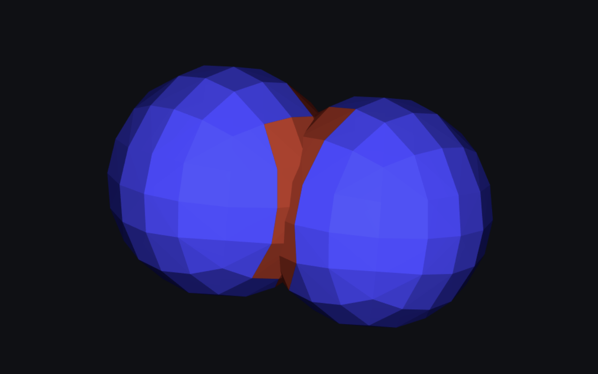
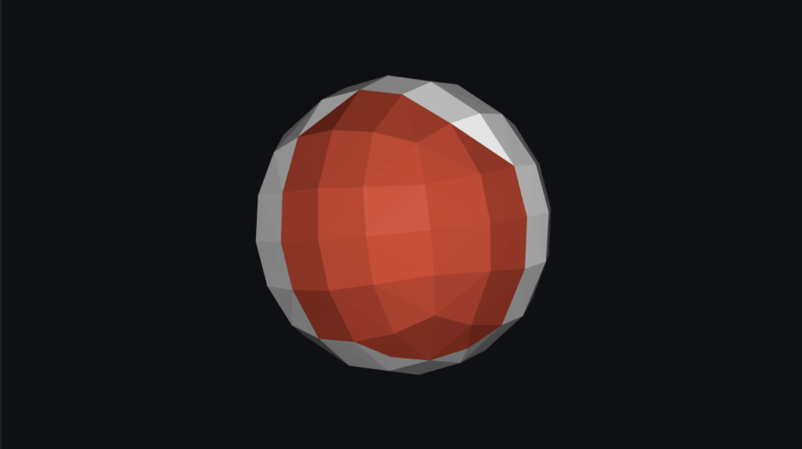
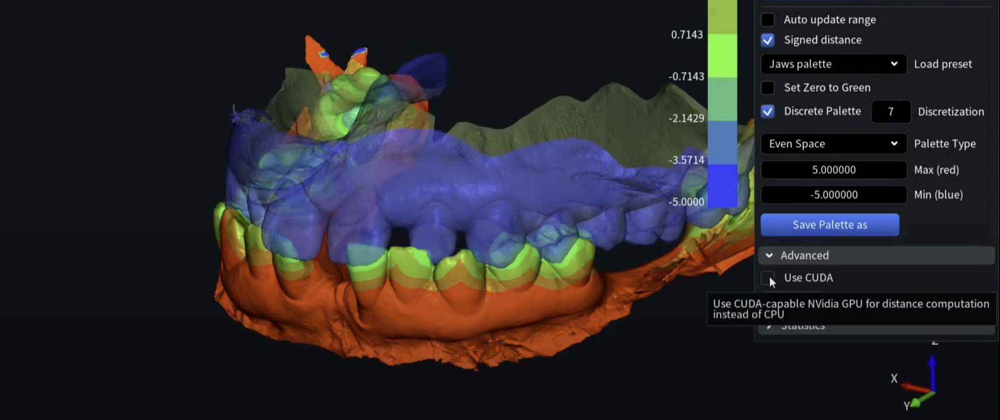

# How to get the faces which are penetrating the colliding mesh?

Get the faces data of the collision area of the mesh.






## Simple Cases

Try to use boundaries of the selection to fill its inner part using:

`MeshSDK/source/MRMesh/MRRegionBoundary.h`

Lines 27 to 31 in 2129ff0

```cpp
 /// returns all region boundary loops; 
 /// every loop has region faces on the right, and not-region faces or holes on the left 
 [[nodiscard]] MRMESH_API std::vector<EdgeLoop> findRightBoundary( const MeshTopology & topology, const FaceBitSet * region = nullptr ); 
 [[nodiscard]] inline std::vector<EdgeLoop> findRightBoundary( const MeshTopology & topology, const FaceBitSet & region ) 
     { return findRightBoundary( topology, &region ); } 
```

and

`MeshSDK/source/MRMesh/MRFillContour.h`

Lines 8 to 10 in 2129ff0

```cpp
 // fill region located to the left from given edges 
 MRMESH_API FaceBitSet fillContourLeft( const MeshTopology & topology, const EdgePath & contour ); 
 MRMESH_API FaceBitSet fillContourLeft( const MeshTopology & topology, const std::vector<EdgePath> & contours ); 
```

To do so, you need to find longest loop (in your case). But in common case loops could have complex topology.

Other way is to use

`MeshSDK/source/MRMesh/MRMeshBoolean.h`

Lines 103 to 121 in 2129ff0

```cpp
 /// vertices and points representing mesh intersection result 
 struct BooleanResultPoints 
 { 
     VertBitSet meshAVerts; 
     VertBitSet meshBVerts; 
     std::vector<Vector3f> intersectionPoints; 
 }; 
  
 /** \brief Returns the points of mesh boolean's result mesh 
  * 
  * \ingroup BooleanGroup 
  * Returns vertices and intersection points of mesh that is result of boolean operation of mesh `A` and mesh `B`. 
  * Can be used as fast alternative for cases where the mesh topology can be ignored (bounding box, convex hull, etc.) 
  * \param meshA Input mesh `A` 
  * \param meshB Input mesh `B` 
  * \param operation Boolean operation to perform 
  * \param rigidB2A Transform from mesh `B` space to mesh `A` space 
  */ 
  MRMESH_API Expected<BooleanResultPoints,std::string> getBooleanPoints( const Mesh& meshA, const Mesh& meshB, BooleanOperation operation, 
```

with `BooleanOperation::InideA` or `BooleanOperation::InideB`, and use result `VertBitSet`.

## Find Penetration

The code snippet for reference:

```py
mesh1 = mm.loadMesh(mesh1Path)
mesh2 = mm.loadMesh(mesh2Path)

booleanVertices = mm.getBooleanPoints(mesh1, mesh2, mm.BooleanOperation.Intersection)

mesh1Verts = booleanVertices.meshAVerts
mesh2Verts = booleanVertices.meshBVerts

meshPoints = mm.MeshOrPoints(mesh1)
getPoint = meshPoints.points()

pointVectors = list()
for verts in mesh1Verts:
    pointVectors.append(getPoint._Subscript(verts))
    
dir = mesh2.computeBoundingBox().center() - mesh1.computeBoundingBox().center()

meshPart = mm.MeshPart(mesh2)
dist = list()

for point in pointVectors:
    line = mm.Line3f(point, dir)
    rayIntersectionResult = mm.rayMeshIntersect(meshPart, line)
    if(rayIntersectionResult.__bool__()):
        print(rayIntersectionResult.distanceAlongLine)
        dist.append(rayIntersectionResult.distanceAlongLine)
```

### Mode Depth

In `MeshSDK/source/MRMesh/MRMeshMeshDistance.h`

Lines 41 to 47 in a4345b1

```cpp
 /** 
  * \brief computes minimal distance between two meshes 
  * \param rigidB2A rigid transformation from B-mesh space to A mesh space, nullptr considered as identity transformation 
  * \param upDistLimitSq upper limit on the positive distance in question, if the real distance is larger than the function exists returning upDistLimitSq and no valid points 
  */ 
 MRMESH_API MeshMeshSignedDistanceResult findSignedDistance( const MeshPart & a, const MeshPart & b, 
     const AffineXf3f* rigidB2A = nullptr, float upDistLimitSq = FLT_MAX ); 
```

Or you can use double version of `rayMeshIntersect()` to avoid precision issues. (we use precise predicates inside). To do so you need to use `Line3d` instead of `Line3f`.
