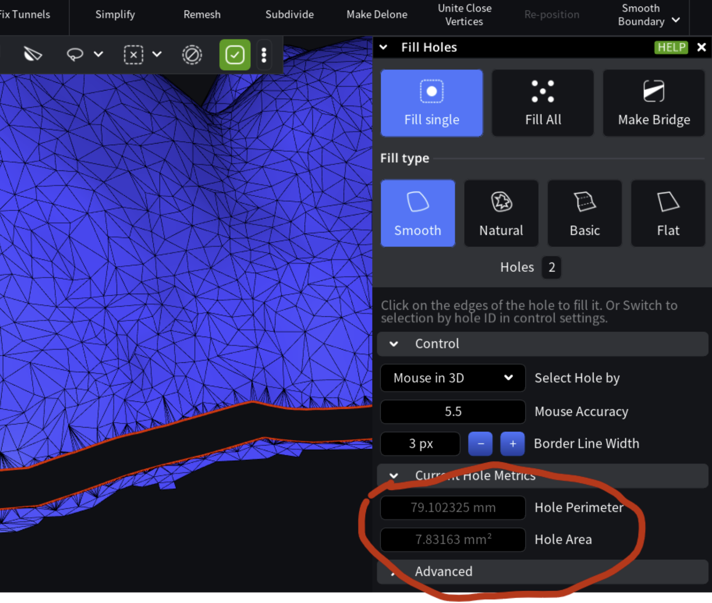

# Current Hole Metrics in Fill Hole

The Current Hole Metrics option in fill hole menu, how can i get this information and is there a better way to this? (useful for identifying the smallest and the largest hole present in mesh)



Use these functions to calculate hole perimeter and area:

`asmesh/source/MRMesh/MRMesh.h`

Lines 182 to 187 in 40a8983

```cpp
/// computes the perimeter of the hole specified by one of its edges with no valid left face (left is hole) 
[[nodiscard]] MRMESH_API double holePerimiter( EdgeId e ) const; 

/// computes directed area of the hole specified by one of its edges with no valid left face (left is hole); 
/// if the hole is planar then returned vector is orthogonal to the plane pointing outside and its magnitude is equal to hole area 
[[nodiscard]] MRMESH_API Vector3d holeDirArea( EdgeId e ) const; 
```
