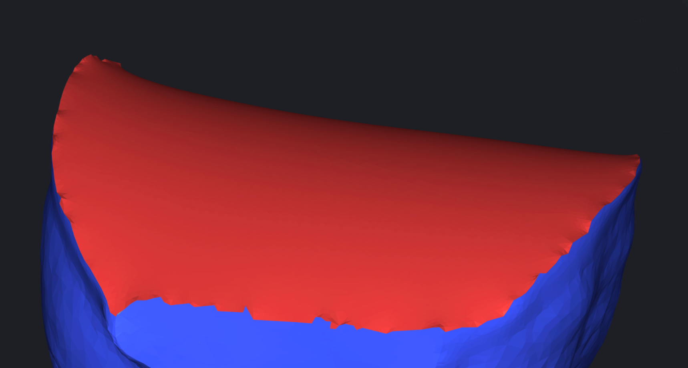
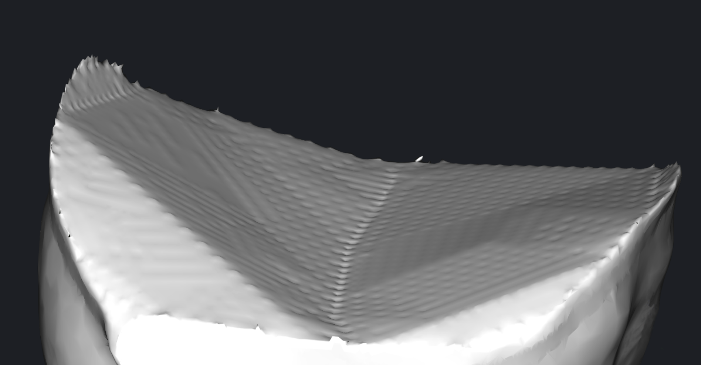

# Fill and Inflate a hole in the mesh

Not to call `subdivizion` explicitly, but use `FillHoleNicely` for it, it performs `subdivideMesh` inside, it can be controlled with:

```py
/// Subdivision is stopped when all edges inside or on the boundary of the region are not longer than this value
float maxEdgeLen = 0;

/// Maximum number of edge splits allowed during subdivision
int maxEdgeSplits = 1000;
```

then you can use `getIncidentVerts` or `getInnerVerts` function to find vertices for inflate.




```py
from meshsdk import mrmeshpy as mm

mesh = mm.loadMesh("input mesh.stl")

params = mm.FillHoleNicelySettings()
params.maxEdgeSplits = 1000000 # just a big number not to stop subdivision by this criteria
params.maxEdgeLen = mesh.averageEdgeLength() # stop subdivision by this criteria

holeEdges = mesh.topology.findHoleRepresentiveEdges()
maxAreaHole = mm.EdgeId()
maxHoleAreaSq = 0

# find max area hole
for e in holeEdges:
    areaSq = mesh.holeDirArea(e).lengthSq()
    if (areaSq > maxHoleAreaSq):
        maxHoleAreaSq = areaSq
        maxAreaHole = e

# fill holes
for e in holeEdges:
    params.smoothCurvature = bool(e != maxAreaHole) # smooth curvature does not make sense if inflation is applied afterwards
    newFaces = mm.fillHoleNicely(mesh,e,params)
    if (e==maxAreaHole):
        newVerts = mm.getInnerVerts(mesh.topology,newFaces)
        infParams = mm.InflateSettings()
        infParams.pressure = 5
        mm.inflate(mesh,newVerts,infParams)

mm.saveMesh(mesh,"output mesh.stl")
```

