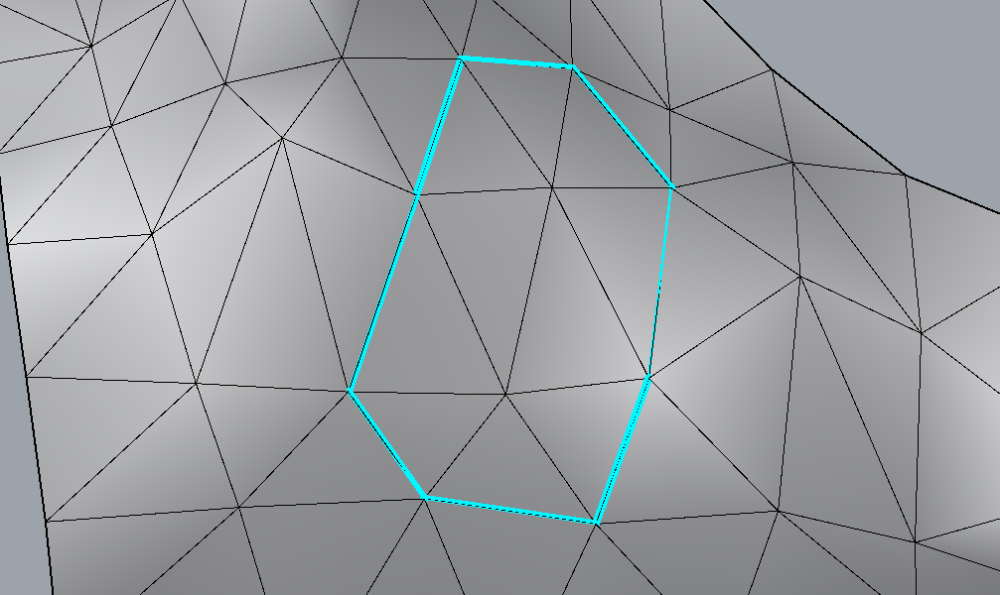
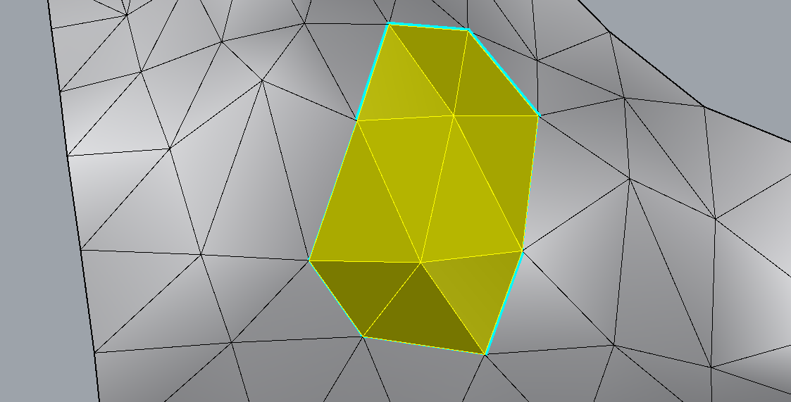
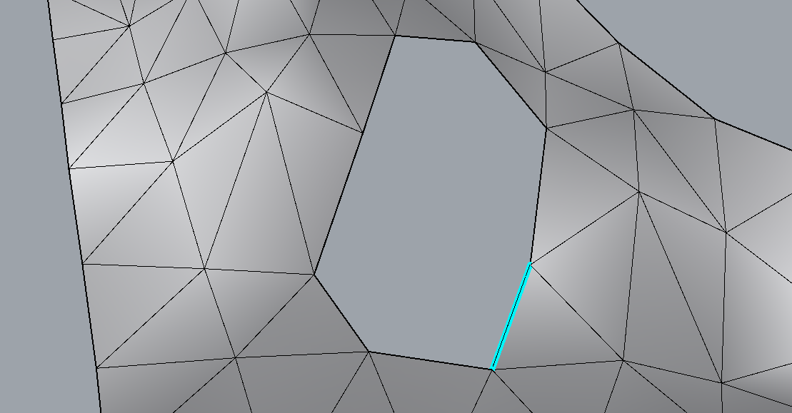
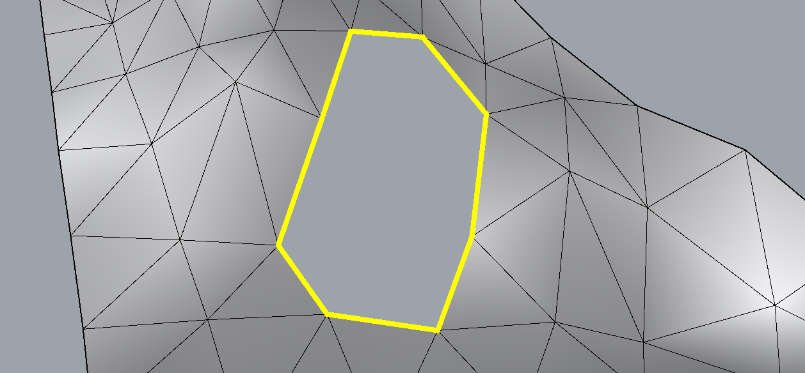
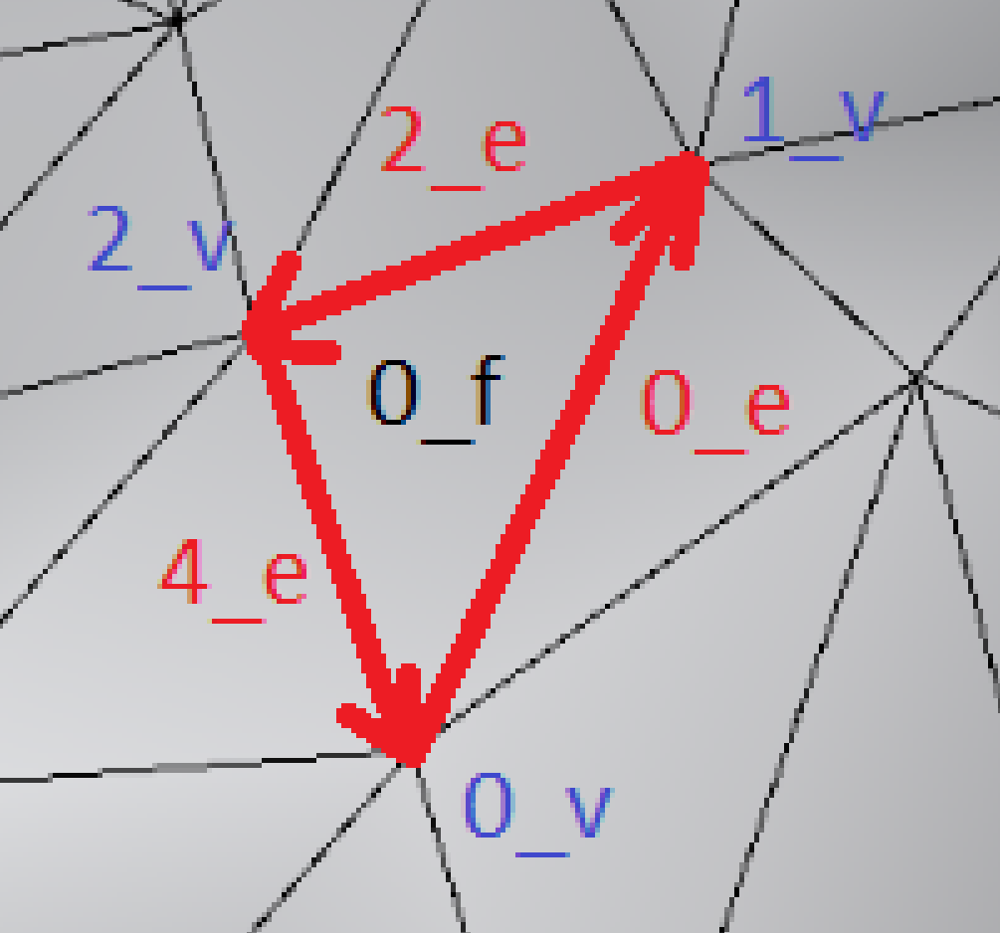
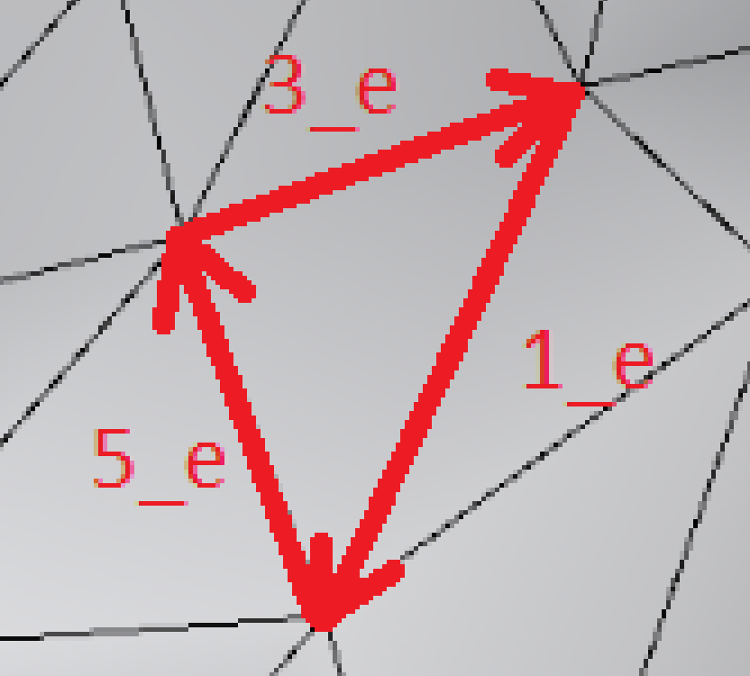
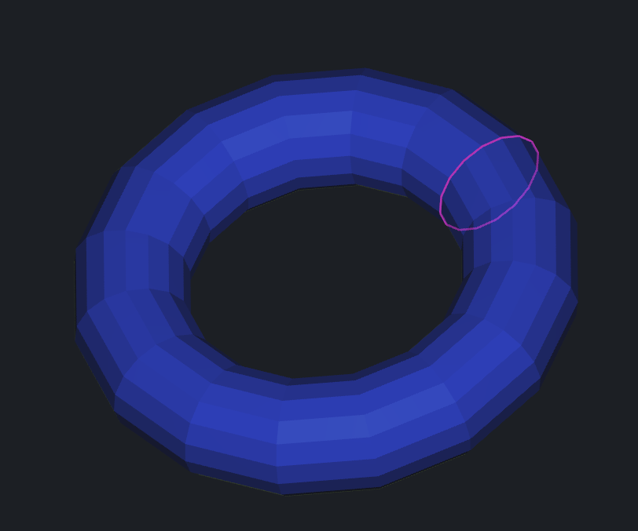
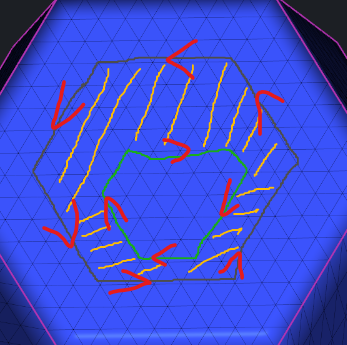

# Mesh Traversal

A better understanding of how to navigate the mesh topology.






## Intro

1.`MeshTriPoint` contains `EdgeId e`

```cpp
FaceId intersectionFace = mesh.topology.left( meshTriPoint.e ); // on this face ray intersects mesh
std::optional<MeshEdgePoint> interEdge = meshTriPoint.onEdge( mesh.topology ); // if ray intersects mesh exactly on edge optional is not null
VertId interVert = meshTriPoint.inVertex( mesh.topology ); // if ray intersects mesh exactly in vertex VertId is valid()
```




Basic navigation:

```cpp
// left face
assert( mesh.topology.left( 0_e ) == 0_f  );
assert( mesh.topology.left( 2_e ) == 0_f  );
assert( mesh.topology.left( 4_e ) == 0_f  );

// change edge direction
assert( 0_e.sym() == 1_e && 1_e.sym() == 0_e );
assert( 2_e.sym() == 3_e && 3_e.sym() == 2_e );
assert( 4_e.sym() == 5_e && 5_e.sym() == 4_e );

// vertices
assert( mesh.topology.org( 0_e ) == 0_v ); 
assert( mesh.topology.org( 5_e ) == 0_v );
assert( mesh.topology.dest( 4_e ) == 0_v );
assert( mesh.topology.dest( 1_e ) == 0_v );

assert( mesh.topology.org( 2_e ) == 1_v );
assert( mesh.topology.org( 1_e ) == 1_v );
assert( mesh.topology.dest( 0_e ) == 1_v );
assert( mesh.topology.dest( 3_e ) == 1_v );

assert( mesh.topology.org( 4_e ) == 2_v );
assert( mesh.topology.org( 3_e ) == 2_v );
assert( mesh.topology.dest( 2_e ) == 2_v );
assert( mesh.topology.dest( 5_e ) == 2_v );

// edge rings
assert( mesh.topology.next( 0_e ) == 5_e );
assert( mesh.topology.next( 2_e ) == 1_e );
assert( mesh.topology.next( 4_e ) == 3_e );

assert( mesh.topology.prev( 1_e ) == 2_e );
assert( mesh.topology.prev( 3_e ) == 4_e );
assert( mesh.topology.prev( 5_e ) == 0_e );
```

Loops:

```cpp
// to iterate over all edges with same origin vertex  as firstEdge (INCLUDING firstEdge)
// for ( Edge e : orgRing( topology, firstEdge ) ) ...
inline IteratorRange<OrgRingIterator> orgRing( const MeshTopology & topology, EdgeId edge )
    { return { OrgRingIterator( topology, edge, edge.valid() ), OrgRingIterator( topology, edge, false ) }; }
inline IteratorRange<OrgRingIterator> orgRing( const MeshTopology & topology, VertId v )
    { return orgRing( topology, topology.edgeWithOrg( v ) ); }

// to iterate over all edges with same origin vertex as firstEdge (EXCLUDING firstEdge)
// for ( Edge e : orgRing0( topology, firstEdge ) ) ...
inline IteratorRange<OrgRingIterator> orgRing0( const MeshTopology & topology, EdgeId edge )
    { return { ++OrgRingIterator( topology, edge, true ), OrgRingIterator( topology, edge, false ) }; }


// to iterate over all edges with same left face as firstEdge (INCLUDING firstEdge)
// for ( Edge e : leftRing( topology, firstEdge ) ) ...
inline IteratorRange<LeftRingIterator> leftRing( const MeshTopology & topology, EdgeId edge )
    { return { LeftRingIterator( topology, edge, edge.valid() ), LeftRingIterator( topology, edge, false ) }; }
inline IteratorRange<LeftRingIterator> leftRing( const MeshTopology & topology, FaceId f )
    { return leftRing( topology, topology.edgeWithLeft( f ) ); }

// to iterate over all edges with same left face as firstEdge (EXCLUDING firstEdge)
// for ( Edge e : leftRing0( topology, firstEdge ) ) ...
inline IteratorRange<LeftRingIterator> leftRing0( const MeshTopology & topology, EdgeId edge )
    { return { ++LeftRingIterator( topology, edge, true ), LeftRingIterator( topology, edge, false ) }; }
```

2.If cyan loop has yellow region to the left you can use:

```cpp
// fill region located to the left from given edges
MRMESH_API FaceBitSet fillContourLeft( const MeshTopology & topology, const EdgePath & contour );
MRMESH_API FaceBitSet fillContourLeft( const MeshTopology & topology, const std::vector<EdgePath> & contours );
```

otherwise you need to reverse loop first

```cpp
/// reverses the order of edges and flips each edge orientation, thus
/// making the opposite directed edge path
MRMESH_API void reverse( EdgePath & path );
/// reverse every path in the vector
MRMESH_API void reverse( std::vector<EdgePath> & paths );
```

if your mesh has tonnel:


you can use

```cpp
/**
 * \brief Fills region located to the left from given contour, by minimizing the sum of metric over the boundary
 * \ingroup MeshSegmentationGroup
 */
MRMESH_API FaceBitSet fillContourLeftByGraphCut( const MeshTopology & topology, const EdgePath & contour,
    const EdgeMetric & metric );

/**
 * \brief Fills region located to the left from given contours, by minimizing the sum of metric over the boundary
 * \ingroup MeshSegmentationGroup
 */
MRMESH_API FaceBitSet fillContourLeftByGraphCut( const MeshTopology & topology, const std::vector<EdgePath> & contours,
    const EdgeMetric & metric );
```

3.We have some functions for this:

```cpp
// MeshTopology:
/// returns closed loop of boundary edges starting from given boundary edge, 
/// which has region face to the right and does not have valid or in-region left face;
/// unlike MR::trackRegionBoundaryLoop this method returns loops in opposite orientation
[[deprecated( "use trackRightBoundaryLoop(...) instead" )]]
[[nodiscard]] MRMESH_API EdgeLoop trackBoundaryLoop( EdgeId e0, const FaceBitSet * region = nullptr ) const;
/// returns all boundary loops, where each edge has region face to the right and does not have valid or in-region left face;
/// unlike MR::findRegionBoundary this method returns loops in opposite orientation
[[deprecated( "use findRightBoundary(...) instead" )]]
[[nodiscard]] MRMESH_API std::vector<EdgeLoop> findBoundary( const FaceBitSet * region = nullptr ) const;
/// returns one edge with no valid left face for every boundary in the mesh
[[nodiscard]] MRMESH_API std::vector<EdgeId> findHoleRepresentiveEdges() const;


// MRRegionBoundary.h:
// returns closed loop of region boundary starting from given region boundary edge (region faces on the left, and not-region faces or holes on the right);
// if more than two boundary edges connect in one vertex, then the function makes the most abrupt turn to right
[[nodiscard]] MRMESH_API EdgeLoop trackLeftBoundaryLoop( const MeshTopology & topology, EdgeId e0, const FaceBitSet * region = nullptr );
[[nodiscard]] inline EdgeLoop trackLeftBoundaryLoop( const MeshTopology & topology, const FaceBitSet & region, EdgeId e0 )
    { return trackLeftBoundaryLoop( topology, e0, &region ); }

// returns closed loop of region boundary starting from given region boundary edge (region faces on the right, and not-region faces or holes on the left);
// if more than two boundary edges connect in one vertex, then the function makes the most abrupt turn to left
[[nodiscard]] MRMESH_API EdgeLoop trackRightBoundaryLoop( const MeshTopology & topology, EdgeId e0, const FaceBitSet * region = nullptr );
[[nodiscard]] inline EdgeLoop trackRightBoundaryLoop( const MeshTopology & topology, const FaceBitSet & region, EdgeId e0 )
    { return trackRightBoundaryLoop( topology, e0, &region ); }

// returns all region boundary loops;
// every loop has region faces on the left, and not-region faces or holes on the right
[[nodiscard]] MRMESH_API std::vector<EdgeLoop> findLeftBoundary( const MeshTopology & topology, const FaceBitSet * region = nullptr );
[[nodiscard]] inline std::vector<EdgeLoop> findLeftBoundary( const MeshTopology & topology, const FaceBitSet & region )
    { return findLeftBoundary( topology, &region ); }

// returns all region boundary loops;
// every loop has region faces on the right, and not-region faces or holes on the left
[[nodiscard]] MRMESH_API std::vector<EdgeLoop> findRightBoundary( const MeshTopology & topology, const FaceBitSet * region = nullptr );
[[nodiscard]] inline std::vector<EdgeLoop> findRightBoundary( const MeshTopology & topology, const FaceBitSet & region )
    { return findRightBoundary( topology, &region ); }
```

You can have a look at `MRExpandShrink.h`

```cpp
// adds to the region all faces within given number of hops (stars) from the initial region boundary
MRMESH_API void expand( const MeshTopology & topology, FaceBitSet & region, int hops = 1 );
// returns the region of all faces within given number of hops (stars) from the initial face
[[nodiscard]] MRMESH_API FaceBitSet expand( const MeshTopology & topology, FaceId f, int hops );

// adds to the region all vertices within given number of hops (stars) from the initial region boundary
MRMESH_API void expand( const MeshTopology & topology, VertBitSet & region, int hops = 1 );
// returns the region of all vertices within given number of hops (stars) from the initial vertex
[[nodiscard]] MRMESH_API VertBitSet expand( const MeshTopology & topology, VertId v, int hops );

// removes from the region all faces within given number of hops (stars) from the initial region boundary
MRMESH_API void shrink( const MeshTopology & topology, FaceBitSet & region, int hops = 1 );
// removes from the region all vertices within given number of hops (stars) from the initial region boundary
MRMESH_API void shrink( const MeshTopology & topology, VertBitSet & region, int hops = 1 );
and MREdgePath.h

/// expands the region (of faces or vertices) on given metric value. returns false if callback also returns false
MRMESH_API bool dilateRegionByMetric( const MeshTopology& topology, const EdgeMetric& metric, FaceBitSet& region, float dilation, ProgressCallback callback = {} );
MRMESH_API bool dilateRegionByMetric( const MeshTopology& topology, const EdgeMetric& metric, VertBitSet& region, float dilation, ProgressCallback callback = {} );
MRMESH_API bool dilateRegionByMetric( const MeshTopology& topology, const EdgeMetric& metric, UndirectedEdgeBitSet& region, float dilation, ProgressCallback callback = {} );

/// shrinks the region (of faces or vertices) on given metric value. returns false if callback also returns false
MRMESH_API bool erodeRegionByMetric( const MeshTopology& topology, const EdgeMetric& metric, FaceBitSet& region, float dilation, ProgressCallback callback = {} );
MRMESH_API bool erodeRegionByMetric( const MeshTopology& topology, const EdgeMetric& metric, VertBitSet& region, float dilation, ProgressCallback callback = {} );
MRMESH_API bool erodeRegionByMetric( const MeshTopology& topology, const EdgeMetric& metric, UndirectedEdgeBitSet& region, float dilation, ProgressCallback callback = {} );

/// expands the region (of faces or vertices) on given value (in meters). returns false if callback also returns false
MRMESH_API bool dilateRegion( const Mesh& mesh, FaceBitSet& region, float dilation, ProgressCallback callback = {} );
MRMESH_API bool dilateRegion( const Mesh& mesh, VertBitSet& region, float dilation, ProgressCallback callback = {} );
MRMESH_API bool dilateRegion( const Mesh& mesh, UndirectedEdgeBitSet& region, float dilation, ProgressCallback callback = {} );

/// shrinks the region (of faces or vertices) on given value (in meters). returns false if callback also returns false
MRMESH_API bool erodeRegion( const Mesh& mesh, FaceBitSet& region, float dilation, ProgressCallback callback = {} );
MRMESH_API bool erodeRegion( const Mesh& mesh, VertBitSet& region, float dilation, ProgressCallback callback = {} );
MRMESH_API bool erodeRegion( const Mesh& mesh, UndirectedEdgeBitSet& region, float dilation, ProgressCallback callback = {} );
```

## Example

Delete the faces between the contours.


The area inside will be to left from both of them

`meshsdk/source/MRMesh/MRFillContour.h`

Lines 8 to 10 in ae1704c

```cpp
// fill region located to the left from given edges 
MRMESH_API FaceBitSet fillContourLeft( const MeshTopology & topology, const EdgePath & contour ); 
MRMESH_API FaceBitSet fillContourLeft( const MeshTopology & topology, const std::vector<EdgePath> & contours ); 
mesh.topology.deleteFaces( fillContourLeft( mesh.topology, contours ) );
mesh.invalidateCaches(); // important to call after direct changing of `MeshTopology`
```
