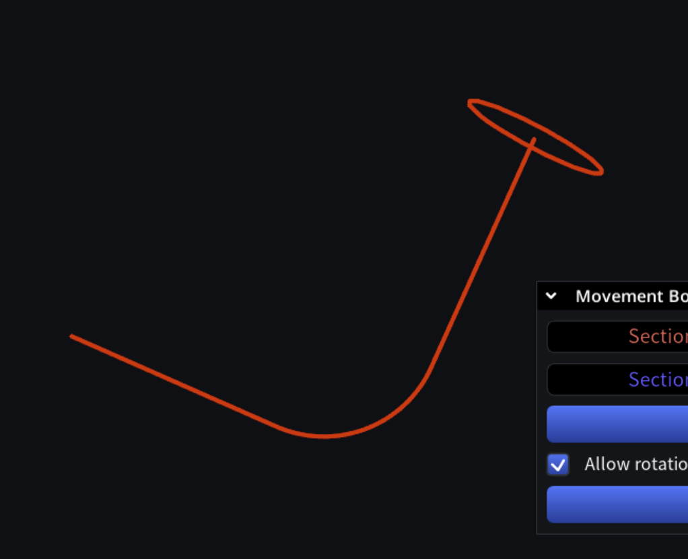
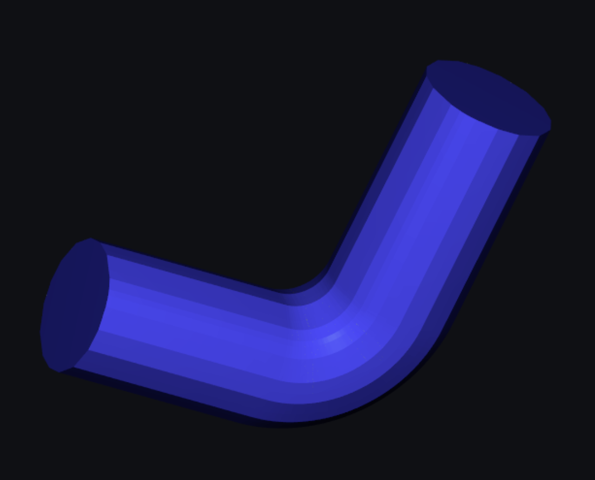
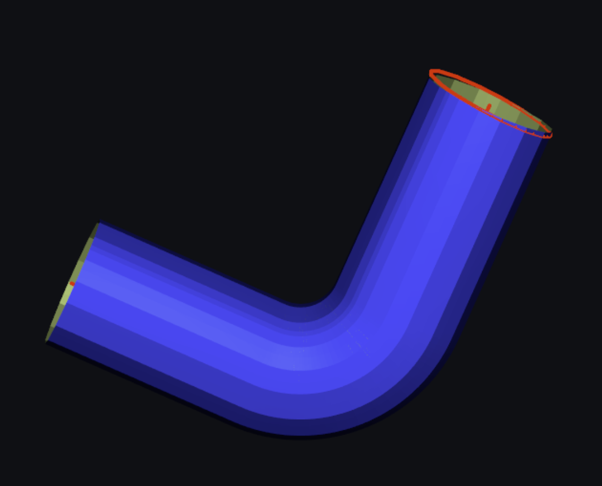

# Mesh Traversal

Convert 3d polyline to a triangle mesh (e.g. cylinder).





## Code

In `source/MRMesh/MRMovementBuildBody.h`:

`Lines 25 to 28 in 7e840df`

```cpp
 /// makes mesh by moving `body` along `trajectory` 
 /// if allowRotation rotate it in corners 
 [[nodiscard]] MRMESH_API Mesh makeMovementBuildBody( const Contours3f& body, const Contours3f& trajectory, 
     const MovementBuildBodyParams& params = {} ); 
```

## Curves are curved, how do I better avoid intersections?

Use Offset tool to fix it (by casting to voxels and back).

In `source/MRMesh/MROffset.h`

`Lines 59 to 61 in 5bb227d`

```cpp
 /// Offsets mesh by converting it to voxels and back 
 /// so result mesh is always closed 
 [[nodiscard]] MRMESH_API Expected<Mesh, std::string> offsetMesh( const MeshPart& mp, float offset, const OffsetParameters& params = {} ); 
```
