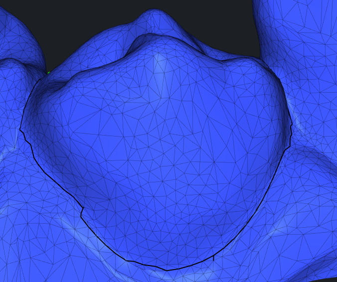
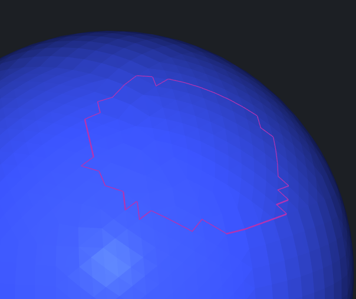
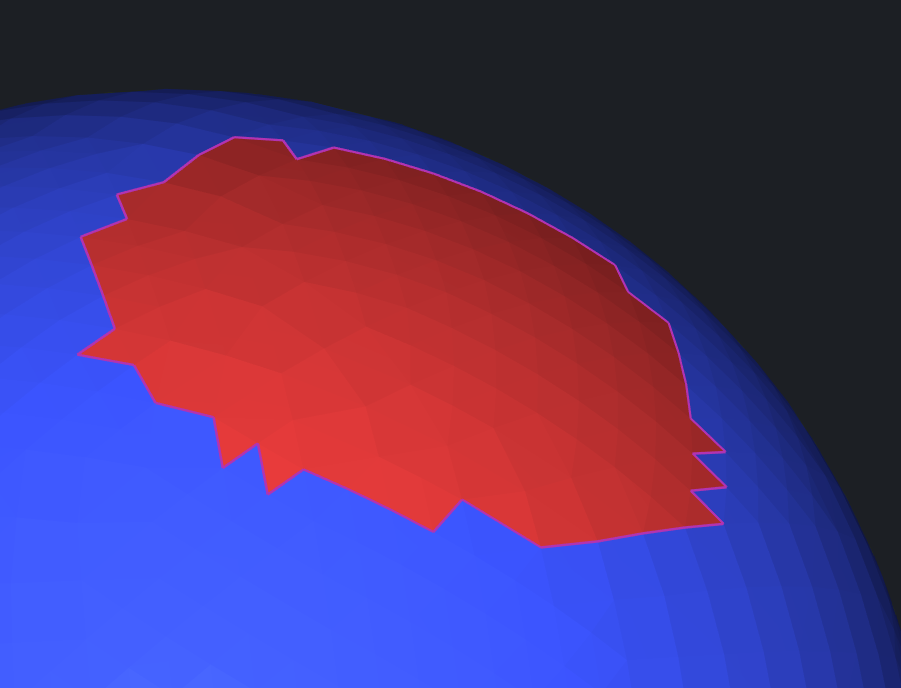
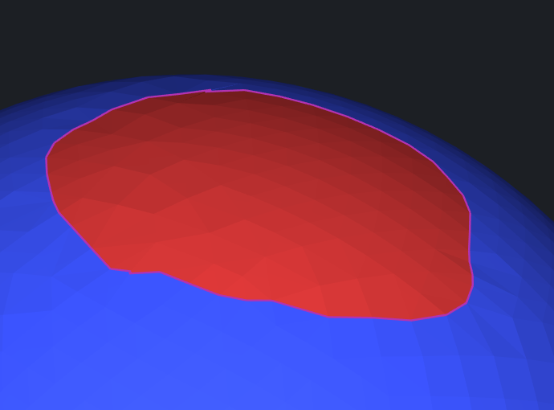

# Smooth EdgePath

Get the EdgePath first, then use smooth function for EdgePath or PolyLine.






## Methods

Use `buildShortestPath` with different metrics.

`asmesh/source/MRMesh/MREdgePaths.h`

Lines 86 to 106 in f9b24b4

```cpp
/// builds shortest path in given metric from start to finish vertices; if no path can be found then empty path is returned 
[[nodiscard]] MRMESH_API EdgePath buildSmallestMetricPath( const MeshTopology & topology, const EdgeMetric & metric, 
    VertId start, VertId finish, float maxPathMetric = FLT_MAX ); 
/// finds the smallest metric path from start vertex to finish vertex, 
/// using bidirectional modification of Dijkstra algorithm, constructing the path simultaneously from both start and finish, which is faster for long paths; 
/// if no path can be found then empty path is returned 
[[nodiscard]] MRMESH_API EdgePath buildSmallestMetricPathBiDir( const MeshTopology & topology, const EdgeMetric & metric, 
    VertId start, VertId finish, float maxPathMetric = FLT_MAX ); 
/// finds the smallest metric path from one of start vertices to one of the finish vertices, 
/// using bidirectional modification of Dijkstra algorithm, constructing the path simultaneously from both starts and finishes, which is faster for long paths; 
/// if no path can be found then empty path is returned 
[[nodiscard]] MRMESH_API EdgePath buildSmallestMetricPathBiDir( const MeshTopology & topology, const EdgeMetric & metric, 
    const TerminalVertex * starts, int numStarts, 
    const TerminalVertex * finishes, int numFinishes, 
    VertId * outPathStart = nullptr,  // if the path is found then its start vertex will be written here (even if start vertex is the same as finish vertex and the path is empty) 
    VertId * outPathFinish = nullptr, // if the path is found then its finish vertex will be written here (even if start vertex is the same as finish vertex and the path is empty) 
    float maxPathMetric = FLT_MAX ); 

/// builds shortest path in given metric from start to finish vertices; if no path can be found then empty path is returned 
[[nodiscard]] MRMESH_API EdgePath buildSmallestMetricPath( const MeshTopology& topology, const EdgeMetric& metric, 
    VertId start, const VertBitSet& finish, float maxPathMetric = FLT_MAX );
```

You can find some basic metrics [here](https://github.com/alpinebuster/meshsdk/blob/main/source/MRMesh/MREdgeMetric.h).
