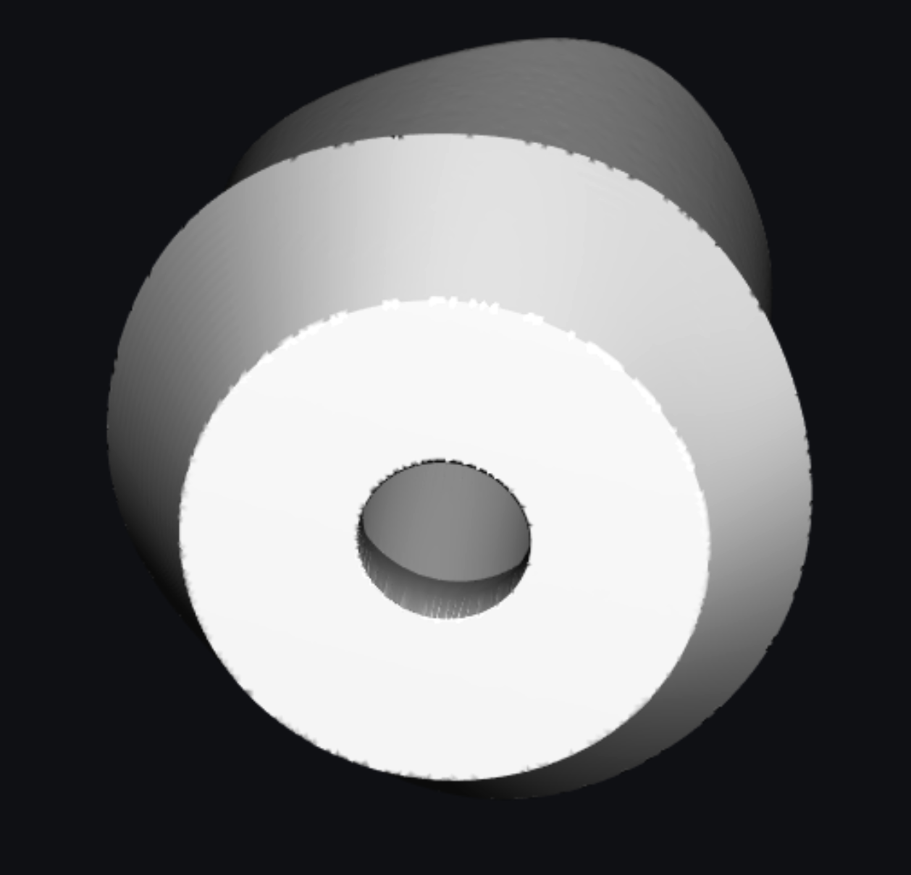
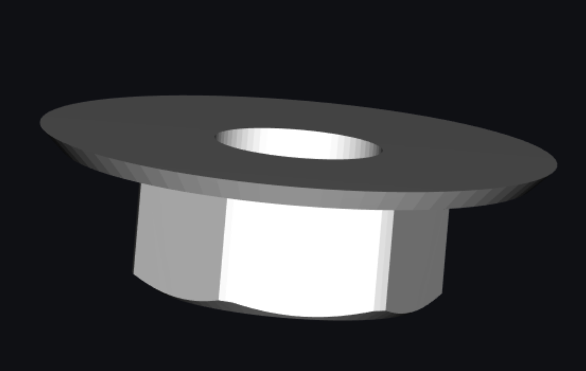
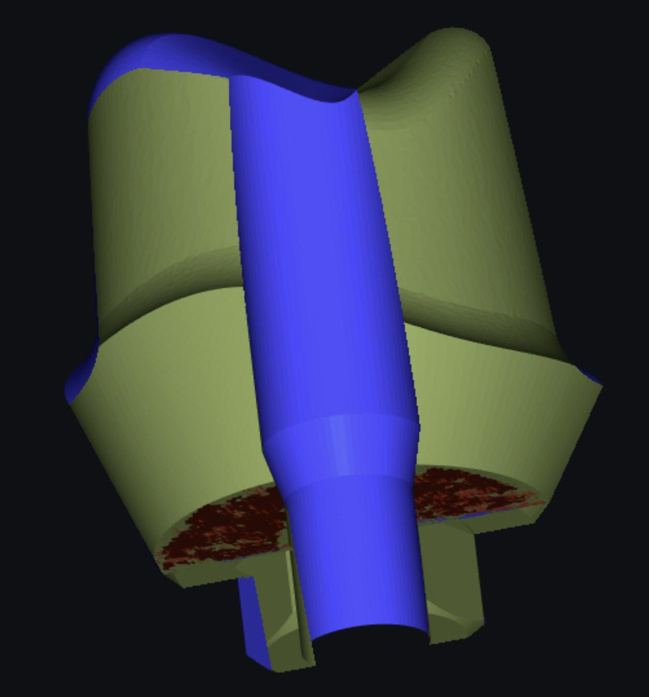

# Stich Two Closed Meshes

When stitching a closed Mesh A and a closed Mesh B. When merged the two meshes and unified close vertices (distance 0.0) to stitch the meshes together. However, after merging, it reports an unwanted overlapping (collision) area like this (red area).





How to delete or remove this overlapping (colliding) area (the red part)?

## Basic Methods

1.Use `MeshLib/source/MRMesh/MROverlappingTris.h`

Lines 21 to 22 in d145d95

```cpp
 /// finds all triangles that have oppositely oriented close triangle in the mesh 
 [[nodiscard]] MRMESH_API Expected<FaceBitSet> findOverlappingTris( const MeshPart & mp, const FindOverlappingSettings & settings ); 
```

to find overlapping faces and mesh.deleteFaces to remove them.

2.Use `MeshLib/source/MRMesh/MRMeshCollide.h`

Lines 38 to 41 in d145d95

```cpp
 /// the same \ref findSelfCollidingTriangles but returns the union of all self-intersecting faces 
 [[nodiscard]] MRMESH_API Expected<FaceBitSet> findSelfCollidingTrianglesBS( const MeshPart & mp, ProgressCallback cb = {}, 
     const Face2RegionMap* regionMap = nullptr, ///< if regionMap is provided then only self-intersections within a region are returned 
     bool touchIsIntersection = false ); ///< if true then treat touching faces as self-intersections too 
```

Set `touchIsIntersection  = true` to find overlapping faces and mesh.deleteFaces to remove them
I suggest the best way is do detect this faces before merging two meshes, or avoid building them (it looks like these faces are side effect of some cutting algorithm).
Also, it seems that uniteCloseVertices will not work it this case, so you will need to use

`MeshLib/source/MRMesh/MRMeshFillHole.h`

Line 108 in d145d95

```cpp
 MRMESH_API void buildCylinderBetweenTwoHoles( Mesh & mesh, EdgeId a, EdgeId b, const StitchHolesParams& params = {} ); 
```

## Remove Border Edges

Use the following code to fix edges connected to multiple faces and then remove overlapping mesh faces and these border edges.

```cpp
fixMultipleEdges(mesh);

auto removeFaces = *findOverlappingTris(mesh, {});
mesh.deleteFaces(removeFaces);

// after deleteFaces fill small holes
{
	FillHoleNicelySettings fillHoleSettings;
	{
		fillHoleSettings.triangulateOnly = false;
		fillHoleSettings.triangulateParams.metric = getComplexStitchMetric(mesh);
	}

	for (auto e : mesh.topology.findHoleRepresentiveEdges())
	{
		if (mesh.holePerimiter(e) < 1)
		{
			fillHole(mesh, e, {});
		}
	}

	FaceBitSet fsLargest = MeshComponents::getLargestComponent(mesh);
	mesh = MeshPart(mesh, &fsLargest).mesh;
}

mesh.invalidateCaches();
```


In the above code sample, do not use fill hole settings

```cpp
FillHoleNicelySettings fillHoleSettings; // not used
{
	fillHoleSettings.triangulateOnly = false;
	fillHoleSettings.triangulateParams.metric = getComplexStitchMetric(mesh);
}
```
Also, this code do nothing:

```cpp
FaceBitSet fsLargest = MeshComponents::getLargestComponent(mesh);
mesh = MeshPart(mesh, &fsLargest).mesh; // do nothing
```

If you want to keep only largest component you should do it like this:

```cpp
FaceBitSet fsLargest = MeshComponents::getLargestComponent(mesh);
	mesh.deleteFaces( mesh.topology.getValidFaces() - fsLargest );
```
